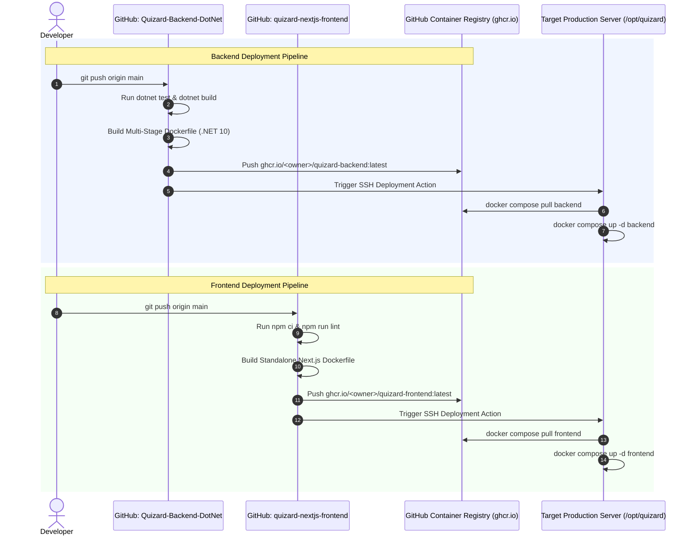

# 🐳 Quizard Multi-Repo Docker & GitHub Actions CI/CD Deployment Guide

> **Document Version:** 1.0  
> **Author:** Quizard Core DevOps & Solution Architecture Team  
> **Target Audience:** DevOps Engineers, Backend Developers, Frontend Developers, System Administrators  
> **Platform:** .NET 10 Web API + Next.js 16/React 19 Frontend + PostgreSQL 16 + Redis 7.4  
> **Target Repositories:**
> * Backend: `Quizard-Backend-DotNet` (ASP.NET Core / .NET 10)
> * Frontend: `quizard-nextjs-frontend` (Next.js 16 / React 19 / Tailwind CSS)
> **Reading Tool:** View directly on GitHub, or locally via `glow DOCKER_AND_GITHUB_ACTIONS_DEPLOYMENT_GUIDE.md`

---

## 📑 Table of Contents

1. [Executive Overview & Multi-Repo Strategy](#1-executive-overview--multi-repo-strategy)
   - [1.1 The Multi-Repository Topology](#11-the-multi-repository-topology)
   - [1.2 Port Allocations & Network Blueprint](#12-port-allocations--network-blueprint)
2. [End-to-End CI/CD & Deployment Architecture Flow](#2-end-to-end-cicd--deployment-architecture-flow)
3. [Backend Containerization: `Quizard-Backend-DotNet`](#3-backend-containerization-quizard-backend-dotnet)
   - [3.1 Production Multi-Stage `Dockerfile`](#31-production-multi-stage-dockerfile)
   - [3.2 Backend `.dockerignore`](#32-backend-dockerignore)
4. [Frontend Containerization: `quizard-nextjs-frontend`](#4-frontend-containerization-quizard-nextjs-frontend)
   - [4.1 Next.js Standalone Configuration (`next.config.js`)](#41-nextjs-standalone-configuration-nextconfigjs)
   - [4.2 Production Multi-Stage `Dockerfile`](#42-production-multi-stage-dockerfile)
   - [4.3 Frontend `.dockerignore`](#43-frontend-dockerignore)
5. [Unified Orchestration: Docker Compose](#5-unified-orchestration-docker-compose)
   - [5.1 Production Server Compose (`docker-compose.yml`)](#51-production-server-compose-docker-composeyml)
   - [5.2 Local Development Compose (`docker-compose.local.yml`)](#52-local-development-compose-docker-composelocalyml)
   - [5.3 Production Environment Config (`.env.production`)](#53-production-environment-config-envproduction)
6. [GitHub Actions CI/CD Pipeline (Multi-Repo)](#6-github-actions-cicd-pipeline-multi-repo)
   - [6.1 Backend Workflow (`.github/workflows/backend-ci-cd.yml`)](#61-backend-workflow-githubworkflowsbackend-ci-cdyml)
   - [6.2 Frontend Workflow (`.github/workflows/frontend-ci-cd.yml`)](#62-frontend-workflow-githubworkflowsfrontend-ci-cdyml)
   - [6.3 GitHub Secrets & GHCR Permissions Configuration](#63-github-secrets--ghcr-permissions-configuration)
7. [Production Server Setup & Nginx Reverse Proxy](#7-production-server-setup--nginx-reverse-proxy)
   - [7.1 Server Directory Structure (`/opt/quizard`)](#71-server-directory-structure-optquizard)
   - [7.2 Nginx Configuration with SSL (Let's Encrypt)](#72-nginx-configuration-with-ssl-lets-encrypt)
8. [Troubleshooting & Day-2 Operations Runbook](#8-troubleshooting--day-2-operations-runbook)
   - [8.1 Database Migration Execution Inside Container](#81-database-migration-execution-inside-container)
   - [8.2 Container Logs & Live Health Monitoring](#82-container-logs--live-health-monitoring)
   - [8.3 Zero-Downtime Rolling Update Sequence](#83-zero-downtime-rolling-update-sequence)

---

## 1. Executive Overview & Multi-Repo Strategy

### 1.1 The Multi-Repository Topology

The Quizard platform operates with two distinct codebases maintained in isolated Git repositories:
1. **Backend Repository (`Quizard-Backend-DotNet`):** Clean Architecture solution built on .NET 10 (C# 13), Entity Framework Core, Serilog, PostgreSQL, and StackExchange.Redis.
2. **Frontend Repository (`quizard-nextjs-frontend`):** Modern reactive web application built with Next.js 16 (App/Pages router), React 19, Tailwind CSS, GSAP, Radix UI, and Crypto-JS.

```
┌────────────────────────────────────────────────────────────────────────┐
│                      TWO SEPARATE GITHUB REPOSITORIES                  │
├───────────────────────────────────┬────────────────────────────────────┤
│ 📦 REPO 1: Backend (.NET 10)      │ 📦 REPO 2: Frontend (Next.js 16)   │
│ • Domain, Application, Infra, Api │ • React 19, Tailwind, Standalone   │
│ • Independent Commit Lifecycle    │ • Independent UI Deployment Cycles │
└─────────────────┬─────────────────┴──────────────────┬─────────────────┘
                  │                                    │
                  ▼                                    ▼
       [ GitHub Container Registry ]        [ GitHub Container Registry ]
       ghcr.io/<owner>/quizard-backend      ghcr.io/<owner>/quizard-frontend
                  │                                    │
                  └─────────────────┬──────────────────┘
                                    ▼
                ┌──────────────────────────────────────┐
                │       TARGET PRODUCTION HOST         │
                │      Docker Compose Orchestration    │
                └──────────────────────────────────────┘
```

### 1.2 Port Allocations & Network Blueprint

| Component | Container Name | Internal Port | Exposed Port | Protocol / Purpose |
| :--- | :--- | :---: | :---: | :--- |
| **Frontend Web** | `quizard-frontend` | `8080` | `8080` | HTTP / Next.js Client User Interface |
| **Backend API** | `quizard-backend` | `5011` | `5011` | HTTP / REST API & Swagger UI |
| **PostgreSQL DB** | `quizard-postgres` | `5432` | `5432` | TCP / Relational Persistence Store |
| **Redis Cache** | `quizard-redis` | `6379` | `6379` | TCP / In-Memory Session & Click Buffer |

---

## 2. End-to-End CI/CD & Deployment Architecture Flow



---

## 3. Backend Containerization: `Quizard-Backend-DotNet`

### 3.1 Production Multi-Stage `Dockerfile`

Place this file in the root directory of `Quizard-Backend-DotNet/Dockerfile`:

```dockerfile
# ==============================================================================
# STAGE 1: Build & Publish via .NET 10 SDK
# ==============================================================================
FROM mcr.microsoft.com/dotnet/sdk:10.0 AS build
WORKDIR /src

# Step 1: Copy solution file and project definitions for cached layer restore
COPY Quizard-Backend-DotNet.slnx Directory.Build.props ./
COPY src/Quizard.Domain/Quizard.Domain.csproj src/Quizard.Domain/
COPY src/Quizard.Application/Quizard.Application.csproj src/Quizard.Application/
COPY src/Quizard.Infrastructure/Quizard.Infrastructure.csproj src/Quizard.Infrastructure/
COPY src/Quizard.Api/Quizard.Api.csproj src/Quizard.Api/

# Restore dependencies
RUN dotnet restore src/Quizard.Api/Quizard.Api.csproj

# Step 2: Copy remaining source code and publish optimized Release binaries
COPY src/ src/
RUN dotnet publish src/Quizard.Api/Quizard.Api.csproj \
    -c Release \
    -o /app/publish \
    --no-restore

# ==============================================================================
# STAGE 2: Ultra-Lean Production Runtime (ASP.NET Core 10)
# ==============================================================================
FROM mcr.microsoft.com/dotnet/aspnet:10.0 AS runtime
WORKDIR /app

# Run under secure non-root user (Linux UID 1654 default in .NET 8+)
USER $APP_UID

# Copy published artifacts from build stage
COPY --from=build /app/publish .

# Expose backend port 5011 (matching frontend NEXT_PUBLIC_BASE_URL)
ENV ASPNETCORE_HTTP_PORTS=5011
ENV ASPNETCORE_ENVIRONMENT=Production
EXPOSE 5011

ENTRYPOINT ["dotnet", "Quizard.Api.dll"]
```

### 3.2 Backend `.dockerignore`

Place this file in `Quizard-Backend-DotNet/.dockerignore`:

```
**/.git
**/.github
**/.idea
**/.vscode
**/bin
**/obj
**/TestResults
secrets.json
*.user
*.log
```

---

## 4. Frontend Containerization: `quizard-nextjs-frontend`

### 4.1 Next.js Standalone Configuration (`next.config.js`)

Next.js includes a native **standalone build mode** that traces all server-side dependencies and produces a self-contained Node server without requiring `node_modules` in production.

Verify that `quizard-nextjs-frontend/next.config.js` includes:

```javascript
/** @type {import('next').NextConfig} */
const nextConfig = {
  output: 'standalone', // <--- Produces self-contained ~80MB Docker image
  reactStrictMode: true,
  poweredByHeader: false,
};

module.exports = nextConfig;
```

### 4.2 Production Multi-Stage `Dockerfile`

Place this file in `quizard-nextjs-frontend/Dockerfile`:

```dockerfile
# ==============================================================================
# STAGE 1: Install Dependencies
# ==============================================================================
FROM node:20-alpine AS deps
WORKDIR /app

RUN apk add --no-cache libc6-compat
COPY package.json package-lock.json ./
RUN npm ci

# ==============================================================================
# STAGE 2: Build Application
# ==============================================================================
FROM node:20-alpine AS builder
WORKDIR /app

COPY --from=deps /app/node_modules ./node_modules
COPY . .

# Build argument for backend API URL (baked into client-side JS bundles at build time)
ARG NEXT_PUBLIC_BASE_URL=http://localhost:5011
ENV NEXT_PUBLIC_BASE_URL=$NEXT_PUBLIC_BASE_URL
ENV NEXT_TELEMETRY_DISABLED=1
ENV NODE_ENV=production

RUN npm run build

# ==============================================================================
# STAGE 3: Production Runner
# ==============================================================================
FROM node:20-alpine AS runner
WORKDIR /app

ENV NODE_ENV=production
ENV PORT=8080
ENV HOSTNAME="0.0.0.0"
ENV NEXT_TELEMETRY_DISABLED=1

# Security: Dedicated system user and group
RUN addgroup --system --gid 1001 nodejs
RUN adduser --system --uid 1001 nextjs

# Copy standalone build output and static public assets
COPY --from=builder /app/public ./public
COPY --from=builder --chown=nextjs:nodejs /app/.next/standalone ./
COPY --from=builder --chown=nextjs:nodejs /app/.next/static ./.next/static

USER nextjs

EXPOSE 8080

CMD ["node", "server.js"]
```

### 4.3 Frontend `.dockerignore`

Place this file in `quizard-nextjs-frontend/.dockerignore`:

```
.git
.github
.next
node_modules
.env.local
.env.development.local
.env.test.local
.env.production.local
npm-debug.log
yarn-error.log
```

---

## 5. Unified Orchestration: Docker Compose

### 5.1 Production Server Compose (`docker-compose.yml`)

This file is deployed on your production server (e.g. `/opt/quizard/docker-compose.yml`):

```yaml
version: '3.8'

services:
  # ---------------------------------------------------------------------------
  # 1. PostgreSQL Database
  # ---------------------------------------------------------------------------
  postgres:
    image: postgres:16-alpine
    container_name: quizard-postgres
    restart: always
    environment:
      POSTGRES_DB: ${POSTGRES_DB:-quizard}
      POSTGRES_USER: ${POSTGRES_USER:-quizard_user}
      POSTGRES_PASSWORD: ${POSTGRES_PASSWORD:?Database password required}
    ports:
      - "5432:5432"
    volumes:
      - postgres_data:/var/lib/postgresql/data
    networks:
      - quizard-network
    healthcheck:
      test: ["CMD-SHELL", "pg_isready -U ${POSTGRES_USER:-quizard_user} -d ${POSTGRES_DB:-quizard}"]
      interval: 5s
      timeout: 5s
      retries: 5

  # ---------------------------------------------------------------------------
  # 2. Redis Distributed In-Memory Cache
  # ---------------------------------------------------------------------------
  redis:
    image: redis:7.4-alpine
    container_name: quizard-redis
    restart: always
    command: redis-server --appendonly yes --requirepass ${REDIS_PASSWORD:?Redis password required}
    ports:
      - "6379:6379"
    volumes:
      - redis_data:/data
    networks:
      - quizard-network
    healthcheck:
      test: ["CMD", "redis-cli", "-a", "${REDIS_PASSWORD}", "ping"]
      interval: 5s
      timeout: 3s
      retries: 5

  # ---------------------------------------------------------------------------
  # 3. .NET 10 Backend Web API
  # ---------------------------------------------------------------------------
  backend:
    image: ghcr.io/${GHCR_OWNER:-tamaldfg}/quizard-backend:latest
    container_name: quizard-backend
    restart: always
    depends_on:
      postgres:
        condition: service_healthy
      redis:
        condition: service_healthy
    environment:
      - ASPNETCORE_ENVIRONMENT=Production
      - ASPNETCORE_HTTP_PORTS=5011
      - ConnectionStrings__DefaultConnection=Host=postgres;Port=5432;Database=${POSTGRES_DB:-quizard};Username=${POSTGRES_USER:-quizard_user};Password=${POSTGRES_PASSWORD}
      - Redis__ConnectionString=redis:6379,password=${REDIS_PASSWORD},abortConnect=false
      - AppConfig__CmsBaseUrl=https://cms.quizard.live
      - AppConfig__WebBaseUrl=https://quizard.live
      - AppConfig__DefaultEventId=34
      - AppConfig__DefaultPortalId=15
    ports:
      - "5011:5011"
    networks:
      - quizard-network

  # ---------------------------------------------------------------------------
  # 4. Next.js Frontend Web Client
  # ---------------------------------------------------------------------------
  frontend:
    image: ghcr.io/${GHCR_OWNER:-tamaldfg}/quizard-frontend:latest
    container_name: quizard-frontend
    restart: always
    depends_on:
      - backend
    environment:
      - PORT=8080
      - HOSTNAME=0.0.0.0
      - NEXT_PUBLIC_BASE_URL=${NEXT_PUBLIC_BASE_URL:-http://localhost:5011}
    ports:
      - "8080:8080"
    networks:
      - quizard-network

networks:
  quizard-network:
    driver: bridge

volumes:
  postgres_data:
    driver: local
  redis_data:
    driver: local
```

### 5.2 Local Development Compose (`docker-compose.local.yml`)

When testing both repositories on your local developer workstation side-by-side:

```yaml
version: '3.8'

services:
  postgres:
    image: postgres:16-alpine
    container_name: quizard-postgres-local
    environment:
      POSTGRES_DB: quizard
      POSTGRES_USER: postgres
      POSTGRES_PASSWORD: password123
    ports:
      - "5432:5432"

  redis:
    image: redis:7.4-alpine
    container_name: quizard-redis-local
    ports:
      - "6379:6379"

  backend:
    build:
      context: ./Quizard-Backend-DotNet
      dockerfile: Dockerfile
    container_name: quizard-backend-local
    ports:
      - "5011:5011"
    environment:
      - ASPNETCORE_ENVIRONMENT=Development
      - ConnectionStrings__DefaultConnection=Host=postgres;Port=5432;Database=quizard;Username=postgres;Password=password123
      - Redis__ConnectionString=redis:6379,abortConnect=false
    depends_on:
      - postgres
      - redis

  frontend:
    build:
      context: ./quizard-nextjs-frontend
      dockerfile: Dockerfile
      args:
        - NEXT_PUBLIC_BASE_URL=http://localhost:5011
    container_name: quizard-frontend-local
    ports:
      - "8080:8080"
    depends_on:
      - backend
```

### 5.3 Production Environment Config (`.env.production`)

Store on your server at `/opt/quizard/.env`:

```bash
GHCR_OWNER=tamaldfg
POSTGRES_DB=quizard
POSTGRES_USER=quizard_prod_user
POSTGRES_PASSWORD=UltraSecurePassword#2026!
REDIS_PASSWORD=SuperSecureRedisSecretKey#2026!
NEXT_PUBLIC_BASE_URL=https://api.quizard.live
```

---

## 6. GitHub Actions CI/CD Pipeline (Multi-Repo)

### 6.1 Backend Workflow (`.github/workflows/backend-ci-cd.yml`)

Place in `Quizard-Backend-DotNet/.github/workflows/backend-ci-cd.yml`:

```yaml
name: Backend CI/CD Pipeline

on:
  push:
    branches: [ "main" ]
  pull_request:
    branches: [ "main" ]

env:
  REGISTRY: ghcr.io
  IMAGE_NAME: ${{ github.repository_owner }}/quizard-backend

jobs:
  build-and-deploy:
    runs-on: ubuntu-latest
    permissions:
      contents: read
      packages: write

    steps:
      - name: 1. Checkout Source Code
        uses: actions/checkout@v4

      - name: 2. Setup .NET 10 SDK
        uses: actions/setup-dotnet@v4
        with:
          dotnet-version: '10.0.x'

      - name: 3. Restore Dependencies
        run: dotnet restore

      - name: 4. Compile Solution
        run: dotnet build --no-restore -c Release

      - name: 5. Execute Unit & Integration Tests
        run: dotnet test --no-build -c Release --verbosity normal

      - name: 6. Authenticate to GitHub Container Registry
        if: github.event_name == 'push' && github.ref == 'refs/heads/main'
        uses: docker/login-action@v3
        with:
          registry: ${{ env.REGISTRY }}
          username: ${{ github.actor }}
          password: ${{ secrets.GITHUB_TOKEN }}

      - name: 7. Build and Push Backend Docker Image
        if: github.event_name == 'push' && github.ref == 'refs/heads/main'
        uses: docker/build-push-action@v5
        with:
          context: .
          push: true
          tags: |
            ${{ env.REGISTRY }}/${{ env.IMAGE_NAME }}:latest
            ${{ env.REGISTRY }}/${{ env.IMAGE_NAME }}:${{ github.sha }}

      - name: 8. Trigger Production Server Update via SSH
        if: github.event_name == 'push' && github.ref == 'refs/heads/main' && secrets.SERVER_HOST != ''
        uses: appleboy/ssh-action@v1.0.3
        with:
          host: ${{ secrets.SERVER_HOST }}
          username: ${{ secrets.SERVER_USER }}
          key: ${{ secrets.SERVER_SSH_KEY }}
          script: |
            cd /opt/quizard
            docker compose pull backend
            docker compose up -d backend
            docker image prune -f
```

### 6.2 Frontend Workflow (`.github/workflows/frontend-ci-cd.yml`)

Place in `quizard-nextjs-frontend/.github/workflows/frontend-ci-cd.yml`:

```yaml
name: Frontend CI/CD Pipeline

on:
  push:
    branches: [ "main" ]
  pull_request:
    branches: [ "main" ]

env:
  REGISTRY: ghcr.io
  IMAGE_NAME: ${{ github.repository_owner }}/quizard-frontend

jobs:
  build-and-deploy:
    runs-on: ubuntu-latest
    permissions:
      contents: read
      packages: write

    steps:
      - name: 1. Checkout Source Code
        uses: actions/checkout@v4

      - name: 2. Setup Node.js 20
        uses: actions/setup-node@v4
        with:
          node-version: 20
          cache: 'npm'

      - name: 3. Install NPM Dependencies
        run: npm ci

      - name: 4. Execute Code Quality & Lint Checks
        run: npm run lint --if-present

      - name: 5. Authenticate to GitHub Container Registry
        if: github.event_name == 'push' && github.ref == 'refs/heads/main'
        uses: docker/login-action@v3
        with:
          registry: ${{ env.REGISTRY }}
          username: ${{ github.actor }}
          password: ${{ secrets.GITHUB_TOKEN }}

      - name: 6. Build and Push Next.js Docker Image
        if: github.event_name == 'push' && github.ref == 'refs/heads/main'
        uses: docker/build-push-action@v5
        with:
          context: .
          push: true
          build-args: |
            NEXT_PUBLIC_BASE_URL=${{ secrets.NEXT_PUBLIC_BASE_URL || 'https://api.quizard.live' }}
          tags: |
            ${{ env.REGISTRY }}/${{ env.IMAGE_NAME }}:latest
            ${{ env.REGISTRY }}/${{ env.IMAGE_NAME }}:${{ github.sha }}

      - name: 7. Trigger Production Server Update via SSH
        if: github.event_name == 'push' && github.ref == 'refs/heads/main' && secrets.SERVER_HOST != ''
        uses: appleboy/ssh-action@v1.0.3
        with:
          host: ${{ secrets.SERVER_HOST }}
          username: ${{ secrets.SERVER_USER }}
          key: ${{ secrets.SERVER_SSH_KEY }}
          script: |
            cd /opt/quizard
            docker compose pull frontend
            docker compose up -d frontend
            docker image prune -f
```

### 6.3 GitHub Secrets & GHCR Permissions Configuration

1. **Enable Package Write Permissions:**
   In both repositories: **Settings $\rightarrow$ Actions $\rightarrow$ General $\rightarrow$ Workflow permissions $\rightarrow$ Select "Read and write permissions"**.
2. **Repository Secrets:**
   Add these in **Settings $\rightarrow$ Secrets and variables $\rightarrow$ Actions**:
   * `SERVER_HOST`: Public IP or domain of your production VPS.
   * `SERVER_USER`: Deploy user (e.g. `ubuntu` or `deploy`).
   * `SERVER_SSH_KEY`: Private SSH key authorized in `/home/ubuntu/.ssh/authorized_keys`.
   * `NEXT_PUBLIC_BASE_URL`: Public API URL (e.g. `https://api.quizard.live`).

---

## 7. Production Server Setup & Nginx Reverse Proxy

### 7.1 Server Directory Structure (`/opt/quizard`)

On your production server, prepare the directory:

```bash
sudo mkdir -p /opt/quizard
sudo chown -R $USER:$USER /opt/quizard
cd /opt/quizard

# Authenticate once to GHCR on your server
echo "<GITHUB_PERSONAL_ACCESS_TOKEN>" | docker login ghcr.io -u <GITHUB_USERNAME> --password-stdin
```

### 7.2 Nginx Configuration with SSL (Let's Encrypt)

Install Nginx and configure reverse proxies for both services:

```nginx
# =============================================================================
# 1. Frontend Web: https://quizard.live -> localhost:8080
# =============================================================================
server {
    server_name quizard.live www.quizard.live;

    location / {
        proxy_pass http://127.0.0.1:8080;
        proxy_http_version 1.1;
        proxy_set_header Upgrade $http_upgrade;
        proxy_set_header Connection 'upgrade';
        proxy_set_header Host $host;
        proxy_cache_bypass $http_upgrade;
        proxy_set_header X-Real-IP $remote_addr;
        proxy_set_header X-Forwarded-For $proxy_add_x_forwarded_for;
        proxy_set_header X-Forwarded-Proto $scheme;
    }

    listen 80;
}

# =============================================================================
# 2. Backend API: https://api.quizard.live -> localhost:5011
# =============================================================================
server {
    server_name api.quizard.live;

    location / {
        proxy_pass http://127.0.0.1:5011;
        proxy_http_version 1.1;
        proxy_set_header Upgrade $http_upgrade;
        proxy_set_header Connection 'upgrade';
        proxy_set_header Host $host;
        proxy_cache_bypass $http_upgrade;
        proxy_set_header X-Real-IP $remote_addr;
        proxy_set_header X-Forwarded-For $proxy_add_x_forwarded_for;
        proxy_set_header X-Forwarded-Proto $scheme;
    }

    listen 80;
}
```

Enable SSL via Certbot:
```bash
sudo certbot --nginx -d quizard.live -d www.quizard.live -d api.quizard.live
```

---

## 8. Troubleshooting & Day-2 Operations Runbook

### 8.1 Database Migration Execution Inside Container

To apply Entity Framework Core migrations on the containerized database:

```bash
# Execute directly inside the running backend container
docker compose exec backend dotnet Quizard.Api.dll --migrate-db

# Or run from your local terminal targeting the server DB
dotnet ef database update --project src/Quizard.Infrastructure --startup-project src/Quizard.Api \
  --connection "Host=<SERVER_IP>;Port=5432;Database=quizard;Username=quizard_user;Password=<PASS>"
```

### 8.2 Container Logs & Live Health Monitoring

```bash
# View aggregated real-time logs across all 4 containers
docker compose logs -f --tail 100

# View specific container logs
docker compose logs -f backend
docker compose logs -f frontend

# Inspect Redis memory usage and live operations
docker compose exec redis redis-cli -a "<REDIS_PASSWORD>" info memory
docker compose exec redis redis-cli -a "<REDIS_PASSWORD>" monitor
```

### 8.3 Zero-Downtime Rolling Update Sequence

When deploying manual updates without restarting PostgreSQL or Redis:

```bash
# 1. Pull latest images from GHCR
docker compose pull backend frontend

# 2. Recreate containers with zero database interruption
docker compose up -d --no-deps backend
docker compose up -d --no-deps frontend

# 3. Clean stale dangling images
docker image prune -f
```

---

*Authored for the Quizard Platform Engineering & DevOps Teams. Maintained in `Quizard-Features` repository.*
