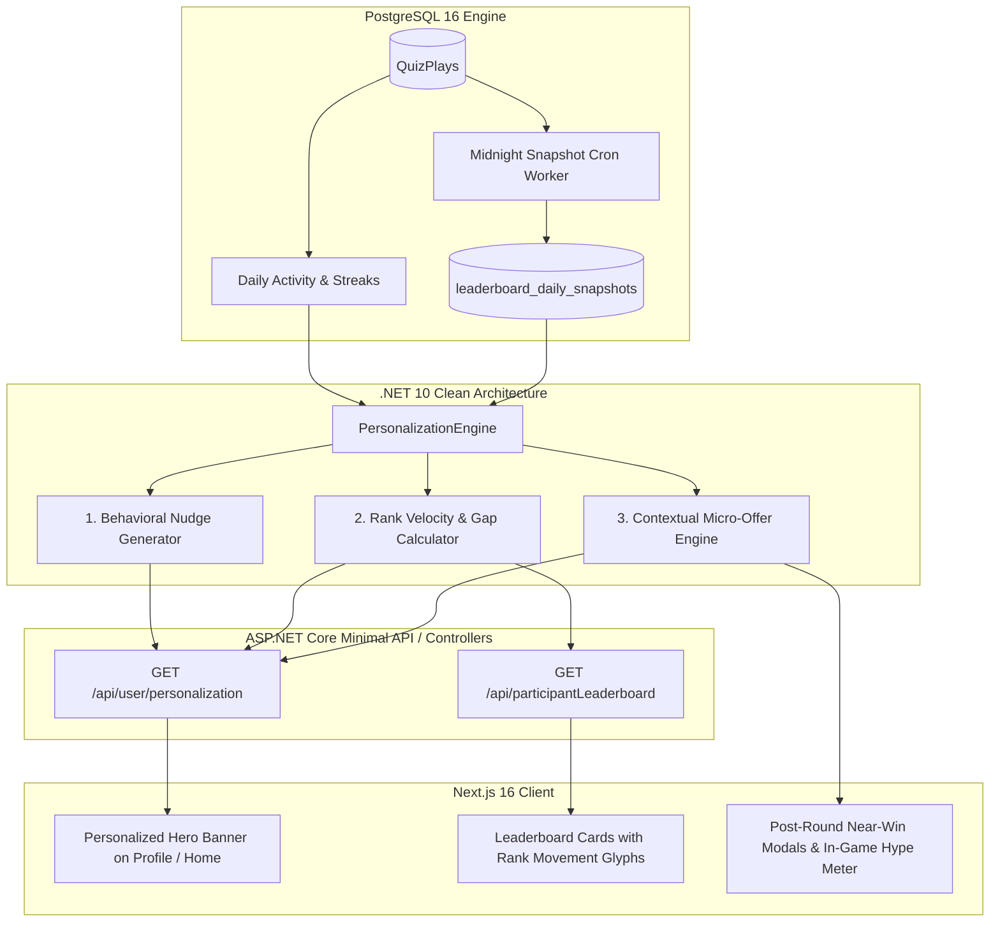

# User Personalization Engine, Rank Velocity, and Retention Nudges (.NET 10 & Next.js)

**Document Reference:** Chapter 08 — *Quizard Platform Engineering Book*  
**Authors:** Digital For Good Engineering Architecture Team  
**Target Framework:** .NET 10 (C# 13) Clean Architecture + PostgreSQL 16 + Next.js 16 (React 19)  
**Reading Utility:** View via `glow USER_PERSONALIZATION_AND_RANK_VELOCITY_IMPLEMENTATION_GUIDE.md` or any Markdown viewer.

---

## 📑 Table of Contents
1. [Executive Summary & Telemetry Insights](#1-executive-summary--telemetry-insights)
2. [High-Level Architectural Workflow](#2-high-level-architectural-workflow)
3. [The 4-Tier Personalization Rules Engine](#3-the-4-tier-personalization-rules-engine)
4. [Real-Time Leaderboard Rank Velocity System](#4-real-time-leaderboard-rank-velocity-system)
   - [4.1 Rank Velocity Formula](#41-rank-velocity-formula)
   - [4.2 Points-to-Top-10 Gap Formula](#42-points-to-top-10-gap-formula)
5. [Dynamic Contextual Micro-Offers](#5-dynamic-contextual-micro-offers)
6. [Sensory In-Game Attractiveness & Hype Mechanics](#6-sensory-in-game-attractiveness--hype-mechanics)
7. [Intelligent Event-Driven Predictive Messaging](#7-intelligent-event-driven-predictive-messaging)
8. [Database Schema & Migrations (PostgreSQL)](#8-database-schema--migrations-postgresql)
9. [Full .NET 10 Implementation Reference](#9-full-net-10-implementation-reference)
   - [9.1 Domain & DTOs](#91-domain--dtos)
   - [9.2 Personalization Service Implementation](#92-personalization-service-implementation)
   - [9.3 Midnight Snapshot Background Worker](#93-midnight-snapshot-background-worker)
   - [9.4 API Controller Integration](#94-api-controller-integration)
10. [Frontend Presentation Reference (Next.js 16)](#10-frontend-presentation-reference-nextjs-16)
    - [10.1 Personalization Nudge Card (`PersonalizationNudgeCard.jsx`)](#101-personalization-nudge-card)
    - [10.2 Rank Velocity Badge & Prize Gap (`RankVelocityBadge.jsx`)](#102-rank-velocity-badge--prize-gap)
    - [10.3 In-Game Combo Audio & Visual Meter (`ComboMeter.jsx`)](#103-in-game-combo-audio--visual-meter)
11. [KPIs & Validation Metrics](#11-kpis--validation-metrics)

---

## 1. Executive Summary & Telemetry Insights

An empirical analysis of 15 days of Quizard production telemetry revealed three decisive behavioral patterns that explain platform churn and engagement gaps:

| Telemetry Finding | Production Metric | Root Cause | Engineering Solution |
| :--- | :--- | :--- | :--- |
| **The 1-Day Churn Cliff** | Over **88% of users** play on day 1 and never return. Only **18 players** held an 8+ day active streak. | Free players hit a rigid paywall and lack reasons to return tomorrow. | **Streak Protection Nudges & Inactivity Win-Back Cards** triggered before midnight cutoff. |
| **The Subscription Multiplier** | Subscribed users answer **3x more correct answers** ($11.42$ vs $1.54$) and attempt **5.6x more questions** ($22.81$ vs $4.06$). | Unsubscribed users hit the 4-question trial wall and abandon sessions. | **Missing Rewards Nudge**: Surface unclaimed cash pool earnings immediately to high-accuracy players. |
| **The Single-Game Silo** | **96.6%** of active contestants only play 1 game genre (Tournament 150). Only **3.4%** ever touched all 4 genres. | Users are unaware of BCS Mind Masters, Wordly, and Sports challenges. | **Cross-Game Discovery Boosters**: Offer 2x XP multipliers for trying a 2nd game genre. |

---

## 2. High-Level Architectural Workflow



---

## 3. The 4-Tier Personalization Rules Engine

The backend evaluates the user's real-time telemetry against a hierarchical set of rules. The highest priority matching rule generates the active nudge:

```
Priority 1: Near-Win Cutoff (Rank 11–15)
     │ (If not matching)
     ▼
Priority 2: Streak Protection (Active Streak ≥ 3, 0 plays today, time ≥ 18:00 BST)
     │ (If not matching)
     ▼
Priority 3: Missing Rewards (Unsubscribed, accuracy ≥ 50%, plays ≥ 1)
     │ (If not matching)
     ▼
Priority 4: Cross-Game Discovery (Distinct games played == 1)
```

### Detailed Rules Matrix:

| Nudge Type | Trigger Condition | Psychological Lever | Copy Headline & Action |
| :--- | :--- | :--- | :--- |
| **NEAR_WIN** | `current_rank BETWEEN 11 AND 15` AND `rank10_gap <= 5` | Loss Aversion (inches from real cash payout) | **Headline:** *"প্রায় জিতে গিয়েছেন!"*<br/>**Body:** *"আপনি ১০ নম্বর নগদ পুরষ্কার জোন থেকে মাত্র {gap} পয়েন্ট দূরে! আরেকটি রাউন্ড খেলে পুরষ্কার নিশ্চিত করুন।"*<br/>**CTA:** `আবার খেলুন (+১ রাউন্ড)` |
| **STREAK_PROTECTION** | `current_streak >= 3` AND `plays_today == 0` AND `hour_bst >= 18` | Sunk Cost Effect (protecting multi-day investment) | **Headline:** *"🔥 আপনার স্ট্রিক ঝুঁকিতে আছে!"*<br/>**Body:** *"আপনার {streak} দিনের স্ট্রিক আজ রাত ১১:৫৯ এ শেষ হয়ে যাবে। ১টি কুইজ খেলে ডে ১৫ (+৫০০ XP) বোনাস ধরে রাখুন।"*<br/>**CTA:** `স্ট্রিক রক্ষা করুন` |
| **MISSING_REWARDS** | `is_subscribed == false` AND `attempts >= 1` AND `accuracy >= 0.50` | FOMO & Value Realization | **Headline:** *"💰 আপনার অর্জিত ক্যাশ পুরষ্কার আনলক করুন"*<br/>**Body:** *"আজ আপনার একুরেসি ছিল {accuracy}%! সাবস্ক্রাইবড খেলোয়াড়রা প্রতি সপ্তাহে ২৫,০০০ টাকা ক্যাশ পুলে প্রতিযোগিতা করছেন।"*<br/>**CTA:** `bKash দিয়ে শুরু করুন (২ টাকা/দিন)` |
| **CROSS_GAME** | `distinct_games_played == 1` AND `total_plays >= 3` | Curiosity & Engagement Diversification | **Headline:** *"✨ নতুন গেম খেলে ২ গুণ XP অর্জন করুন!"*<br/>**Body:** *"আপনি টুর্নামেন্ট স্পেশালিস্ট! আজ BCS মাইন্ড মাস্টার্স খেললে পাবেন ২ গুণ রেটিং ও XP বোনাস।"*<br/>**CTA:** `BCS কুইজ খেলুন` |

---

## 4. Real-Time Leaderboard Rank Velocity System

Static leaderboard displays fail to show upward or downward momentum. Quizard computes **Rank Velocity Vectors** and **Distance-to-Prize Gaps**.

### 4.1 Rank Velocity Formula
Comparing the player's current dense rank ($R_{\text{current}}$) against their midnight snapshot rank ($R_{\text{yesterday}}$):

$$\Delta \text{Rank} = R_{\text{yesterday}} - R_{\text{current}}$$

- **Surging Upward:** $\Delta \text{Rank} > 0 \implies \boldsymbol{\uparrow \Delta \text{Rank}}$ (Rendered in vivid emerald `#10b981`).
- **Slipping Downward:** $\Delta \text{Rank} < 0 \implies \boldsymbol{\downarrow |\Delta \text{Rank}|}$ (Rendered in crimson `#ef4444`).
- **Holding Position:** $\Delta \text{Rank} = 0 \implies \boldsymbol{=}$ (Rendered in slate `#64748b`).

### 4.2 Points-to-Top-10 Gap Formula
The incremental score required for a player ($S_{\text{player}}$) to breach the Top 10 prize zone:

$$S_{\text{gap}} = \max\left(1, \, S_{\text{rank 10}} - S_{\text{player}} + 1\right)$$

*Example:* If Rank 10 holds 51 points and the user currently holds 48 points:
$$S_{\text{gap}} = 51 - 48 + 1 = 4\text{ points needed to surpass Rank 10.}$$

---

## 5. Dynamic Contextual Micro-Offers

Rather than showing static subscription banners, the engine triggers micro-transactions at moments of peak emotional motivation:

```
┌───────────────────────────────────────────────────────────────────────┐
│                      DYNAMIC IN-GAME MICRO-OFFERS                     │
├──────────────────────┬────────────────────────────────────────────────┤
│ The Near-Win Cutoff  │ "So close! Only 2 points away from today's     │
│ (Rank 11-15)         │ 500 BDT cash prize. Unlock 1 Extra Round right │
│                      │ now for 5 BDT (or 150 XP)!"                    │
├──────────────────────┼────────────────────────────────────────────────┤
│ Daily Round          │ "You are on fire today (80% accuracy)! Unlock  │
│ Exhaustion (2/2 Done)│ the Unlimited Evening Tournament Pass for 10   │
│                      │ BDT to keep climbing."                         │
├──────────────────────┼────────────────────────────────────────────────┤
│ Happy Hour Surge     │ "⚡ Happy Hour (9:00 PM – 10:00 PM BST): Play  │
│ (Peak Evening Hour)  │ BCS Mind Masters to earn 2x XP and 1.5x Rating │
│                      │ Boost!"                                        │
├──────────────────────┼────────────────────────────────────────────────┤
│ Streak Shield Offer  │ "Your 9-day streak expires in 3 hours. Claim   │
│ (Late Login)         │ check-in now or equip a Streak Shield for      │
│                      │ 300 XP."                                       │
└──────────────────────┴────────────────────────────────────────────────┘
```

---

## 6. Sensory In-Game Attractiveness & Hype Mechanics

Cognitive immersion directly impacts session length. Quizard deploys sensory reinforcement directly inside the active quiz gameplay canvas (`QuestionBody.js`):

1. **Progressive Combo Meters:**
   - **3 in a row:** Glowing emerald badge floats above the question: `Nice! 🔥`
   - **5 in a row:** Screen edges pulse with cyan electric energy: `On Fire! ⚡ (+5 Bonus XP)`
   - **10 in a row:** Golden confetti explosion and audio fanfare: `UNSTOPPABLE! 🏆`
2. **Tension Countdown (Final 15 Seconds):**
   - The countdown timer turns vivid crimson.
   - A subtle pulsing vignette surrounds the question card accompanied by an accelerated heartbeat sound cue.
3. **One-Tap Shareable Victory Story Card:**
   - Renders a shareable modal on round completion displaying avatar, score, peak rank velocity ($\boldsymbol{\uparrow 8}$), and a WhatsApp / Facebook share button:
   > *"I just scored 54/60 in Quizard Islamic Challenge! Can you beat my score? https://quizard.app/play"*

---

## 7. Intelligent Event-Driven Predictive Messaging

Replace scheduled bulk SMS blast spam with behavioral-triggered notifications:

- **Optimal Time-of-Day Dispatch:** Calculates each user’s median play hour over the last 14 days. If Tanvir plays between 21:00 and 22:00 BST, notification dispatches at 20:45 BST.
- **Rivalry Alert:**
  > *"Contestant 017\*\*\*\*88 just beat your score by 1 point! Take back your #1 spot before the midnight tournament cutoff."*
- **Near-Win Alert:**
  > *"Tanvir, you're currently Rank 12. Only 3 points needed to enter the 500 BDT cash zone! Play your 2nd round now."*

---

## 8. Database Schema & Migrations (PostgreSQL)

```sql
-- 1. Daily Leaderboard Rank Snapshots Table
CREATE TABLE IF NOT EXISTS leaderboard_daily_snapshots (
    id BIGSERIAL PRIMARY KEY,
    msisdn VARCHAR(15) NOT NULL,
    portal_id INT NOT NULL DEFAULT 15,
    event_id INT NOT NULL,
    snapshot_date DATE NOT NULL DEFAULT CURRENT_DATE,
    snapshot_rank INT NOT NULL,
    best_score INT NOT NULL,
    created_at TIMESTAMP WITH TIME ZONE DEFAULT CURRENT_TIMESTAMP
);

-- Compound unique index for ultra-fast snapshot lookups
CREATE UNIQUE INDEX IF NOT EXISTS idx_rank_snapshot 
ON leaderboard_daily_snapshots (msisdn, portal_id, event_id, snapshot_date);

-- Index for event-level rank history queries
CREATE INDEX IF NOT EXISTS idx_snapshot_event_date 
ON leaderboard_daily_snapshots (event_id, snapshot_date);
```

---

## 9. Full .NET 10 Implementation Reference

### 9.1 Domain & DTOs

```csharp
// File: Quizard.Application/Personalization/DTOs/PersonalizationDtos.cs
namespace Quizard.Application.Personalization.DTOs;

public record PersonalizationContextDto(
    string Msisdn,
    bool IsSubscribed,
    int TotalAttemptsToday,
    int DistinctGamesPlayed,
    double AccuracyRatio,
    int CurrentStreak,
    int? CurrentRank,
    int? PreviousRank,
    int? Rank10CutoffScore,
    int UserScore
);

public record PersonalizationCardDto(
    string CardType,       // "NEAR_WIN" | "STREAK_PROTECTION" | "MISSING_REWARDS" | "CROSS_GAME"
    string Title,
    string Message,
    string ActionText,
    string ActionUrl,
    string BadgeText,
    string AccentColor     // "amber" | "purple" | "emerald" | "blue"
);

public record RankVelocityDto(
    int CurrentRank,
    int PreviousRank,
    int RankDelta,
    string Direction,      // "UP" | "DOWN" | "SAME"
    int PointsToTop10Gap
);
```

---

### 9.2 Personalization Service Implementation

```csharp
// File: Quizard.Application/Personalization/Services/PersonalizationService.cs
using Quizard.Application.Personalization.DTOs;

namespace Quizard.Application.Personalization.Services;

public interface IPersonalizationService
{
    PersonalizationCardDto? EvaluateActiveNudge(PersonalizationContextDto ctx);
    RankVelocityDto CalculateRankVelocity(int currentRank, int? yesterdayRank, int userScore, int? rank10Score);
}

public class PersonalizationService : IPersonalizationService
{
    private static readonly TimeZoneInfo BangladeshTimeZone = 
        TimeZoneInfo.FindSystemTimeZoneById("Asia/Dhaka");

    public PersonalizationCardDto? EvaluateActiveNudge(PersonalizationContextDto ctx)
    {
        // 1. NEAR-WIN CUTOFF (Rank 11-15: within striking distance of cash prize)
        if (ctx.CurrentRank is >= 11 and <= 15 && ctx.Rank10CutoffScore.HasValue)
        {
            var gap = Math.Max(1, ctx.Rank10CutoffScore.Value - ctx.UserScore + 1);
            return new PersonalizationCardDto(
                CardType: "NEAR_WIN",
                Title: "🏆 প্রায় জিতে গিয়েছেন!",
                Message: $"আপনি ১০ নম্বর পজিশন থেকে মাত্র {gap} পয়েন্ট দূরে আছেন! আরেকটি রাউন্ড খেলে নগদ পুরষ্কার জোনে প্রবেশ করুন।",
                ActionText: "আবার খেলুন (+১ রাউন্ড)",
                ActionUrl: "/quiz",
                BadgeText: "Top 10 Prize Zone",
                AccentColor: "amber"
            );
        }

        // 2. STREAK PROTECTION (Active 3+ streak at risk late in the day)
        var currentHourBst = TimeZoneInfo.ConvertTimeFromUtc(DateTime.UtcNow, BangladeshTimeZone).Hour;
        if (ctx.CurrentStreak >= 3 && ctx.TotalAttemptsToday == 0 && currentHourBst >= 18)
        {
            return new PersonalizationCardDto(
                CardType: "STREAK_PROTECTION",
                Title: "🔥 আপনার স্ট্রিক ঝুঁকিতে আছে!",
                Message: $"আপনার {ctx.CurrentStreak} দিনের স্ট্রিক আজ রাত ১১:৫৯ এ শেষ হয়ে যাবে। ১টি কুইজ খেলে ডে ১৫ (+৫০০ XP) বোনাস ধরে রাখুন!",
                ActionText: "দ্রুত স্ট্রিক রক্ষা করুন",
                ActionUrl: "/quiz",
                BadgeText: "Streak Alert",
                AccentColor: "purple"
            );
        }

        // 3. MISSING REWARDS (Unsubscribed players with high accuracy >= 50%)
        if (!ctx.IsSubscribed && ctx.TotalAttemptsToday >= 1 && ctx.AccuracyRatio >= 0.50)
        {
            return new PersonalizationCardDto(
                CardType: "MISSING_REWARDS",
                Title: "💰 আপনার অর্জিত ক্যাশ পুরষ্কার আনলক করুন",
                Message: "আজ আপনার পারফরম্যান্স দুর্দান্ত ছিল! সাবস্ক্রাইবড খেলোয়াড়রা সাপ্তাহিক ২৫,০০০ টাকা ক্যাশ পুলে প্রতিযোগিতা করছেন।",
                ActionText: "bKash দিয়ে শুরু করুন (২ টাকা/দিন)",
                ActionUrl: "/subscription",
                BadgeText: "Cash Rewards",
                AccentColor: "emerald"
            );
        }

        // 4. CROSS-GAME ECOSYSTEM DISCOVERY (Single-game players)
        if (ctx.DistinctGamesPlayed == 1)
        {
            return new PersonalizationCardDto(
                CardType: "CROSS_GAME",
                Title: "✨ নতুন গেম খেলে ২ গুণ XP অর্জন করুন!",
                Message: "আপনি টুর্নামেন্ট স্পেশালিস্ট! আজ BCS মাইন্ড মাস্টার্স খেললে পাবেন দ্বিগুণ রেটিং ও XP বোনাস।",
                ActionText: "BCS কুইজ খেলুন",
                ActionUrl: "/tournaments",
                BadgeText: "2x Bonus XP",
                AccentColor: "blue"
            );
        }

        return null;
    }

    public RankVelocityDto CalculateRankVelocity(int currentRank, int? yesterdayRank, int userScore, int? rank10Score)
    {
        var prevRank = yesterdayRank ?? currentRank;
        var delta = prevRank - currentRank; // Was 14, now 9 => +5 (UP)

        var direction = delta > 0 ? "UP" : (delta < 0 ? "DOWN" : "SAME");
        var gap = rank10Score.HasValue ? Math.Max(1, rank10Score.Value - userScore + 1) : 0;

        return new RankVelocityDto(
            CurrentRank: currentRank,
            PreviousRank: prevRank,
            RankDelta: Math.Abs(delta),
            Direction: direction,
            PointsToTop10Gap: currentRank > 10 ? gap : 0
        );
    }
}
```

---

### 9.3 Midnight Snapshot Background Worker

```csharp
// File: Quizard.Infrastructure/BackgroundJobs/MidnightRankSnapshotWorker.cs
using Microsoft.Extensions.Hosting;
using Microsoft.Extensions.Logging;
using Microsoft.Extensions.DependencyInjection;
using Microsoft.EntityFrameworkCore;
using Quizard.Infrastructure.Data;

namespace Quizard.Infrastructure.BackgroundJobs;

public class MidnightRankSnapshotWorker : BackgroundService
{
    private readonly IServiceProvider _serviceProvider;
    private readonly ILogger<MidnightRankSnapshotWorker> _logger;

    public MidnightRankSnapshotWorker(IServiceProvider serviceProvider, ILogger<MidnightRankSnapshotWorker> logger)
    {
        _serviceProvider = serviceProvider;
        _logger = logger;
    }

    protected override async Task ExecuteAsync(CancellationToken stoppingToken)
    {
        while (!stoppingToken.IsCancellationRequested)
        {
            var bangladeshNow = TimeZoneInfo.ConvertTimeFromUtc(
                DateTime.UtcNow, 
                TimeZoneInfo.FindSystemTimeZoneById("Asia/Dhaka"));

            // Calculate delay until next 00:01 AM BST
            var nextRun = bangladeshNow.Date.AddDays(1).AddMinutes(1);
            var delay = nextRun - bangladeshNow;

            _logger.LogInformation("Midnight Rank Snapshot scheduled in {Hours} hours", delay.TotalHours);
            await Task.Delay(delay, stoppingToken);

            await CaptureDailyLeaderboardSnapshotsAsync(stoppingToken);
        }
    }

    private async Task CaptureDailyLeaderboardSnapshotsAsync(CancellationToken ct)
    {
        using var scope = _serviceProvider.CreateScope();
        var db = scope.ServiceProvider.GetRequiredService<QuizardDbContext>();

        try
        {
            // Raw SQL for high-performance bulk insert of closing ranks
            var insertSql = @"
                INSERT INTO leaderboard_daily_snapshots (msisdn, portal_id, event_id, snapshot_date, snapshot_rank, best_score, created_at)
                SELECT 
                    qp.msisdn,
                    qp.portal_id,
                    qp.event_id,
                    CURRENT_DATE,
                    DENSE_RANK() OVER (PARTITION BY qp.event_id, qp.portal_id ORDER BY MAX(qp.right_count) DESC, MIN(qp.time_taken) ASC) as snapshot_rank,
                    MAX(qp.right_count) as best_score,
                    NOW()
                FROM quiz_plays qp
                WHERE qp.is_valid = true AND qp.msisdn IS NOT NULL AND qp.event_id IS NOT NULL
                  AND (qp.date = CURRENT_DATE - INTERVAL '1 day' OR DATE(qp.created_at) = CURRENT_DATE - INTERVAL '1 day')
                GROUP BY qp.msisdn, qp.portal_id, qp.event_id
                ON CONFLICT (msisdn, portal_id, event_id, snapshot_date) DO NOTHING;
            ";

            await db.Database.ExecuteSqlRawAsync(insertSql, ct);
            _logger.LogInformation("Successfully captured daily closing rank snapshots.");
        }
        catch (Exception ex)
        {
            _logger.LogError(ex, "Failed to capture daily rank snapshots.");
        }
    }
}
```

---

### 9.4 API Controller Integration

In `ProfileController.cs`:

```csharp
[HttpGet("user/personalization")]
public async Task<IActionResult> GetPersonalizationNudge(
    [FromQuery] int portal = 15,
    CancellationToken ct = default)
{
    var user = HttpContext.Items["User"] as User;
    if (user == null || string.IsNullOrWhiteSpace(user.Username))
        return Unauthorized();

    var context = await _personalizationRepository.GetPlayerContextAsync(user.Username, portal, ct);
    var nudge = _personalizationService.EvaluateActiveNudge(context);

    return Ok(new { success = true, nudge });
}
```

---

## 10. Frontend Presentation Reference (Next.js 16)

### 10.1 Personalization Nudge Card (`PersonalizationNudgeCard.jsx`)

```jsx
// File: src/components/Common/PersonalizationNudgeCard.jsx
"use client";
import React from "react";
import Link from "next/link";
import { FaFire, FaTrophy, FaCoins, FaSparkles, FaChevronRight } from "react-icons/fa6";

const ACCENT_STYLES = {
  amber: {
    bg: "from-amber-500/10 via-amber-400/5 to-transparent border-amber-300/80 text-amber-900",
    badge: "bg-amber-100 text-amber-800 border-amber-300",
    btn: "bg-gradient-to-r from-amber-500 to-amber-600 text-white shadow-amber-500/30",
    icon: FaTrophy,
  },
  purple: {
    bg: "from-purple-500/10 via-purple-400/5 to-transparent border-purple-300/80 text-purple-900",
    badge: "bg-purple-100 text-purple-800 border-purple-300",
    btn: "bg-gradient-to-r from-purple-600 to-indigo-600 text-white shadow-purple-500/30",
    icon: FaFire,
  },
  emerald: {
    bg: "from-emerald-500/10 via-emerald-400/5 to-transparent border-emerald-300/80 text-emerald-900",
    badge: "bg-emerald-100 text-emerald-800 border-emerald-300",
    btn: "bg-gradient-to-r from-emerald-600 to-teal-600 text-white shadow-emerald-500/30",
    icon: FaCoins,
  },
  blue: {
    bg: "from-blue-500/10 via-blue-400/5 to-transparent border-blue-300/80 text-blue-900",
    badge: "bg-blue-100 text-blue-800 border-blue-300",
    btn: "bg-gradient-to-r from-blue-600 to-indigo-600 text-white shadow-blue-500/30",
    icon: FaSparkles,
  },
};

export default function PersonalizationNudgeCard({ nudge }) {
  if (!nudge) return null;

  const style = ACCENT_STYLES[nudge.accentColor] || ACCENT_STYLES.purple;
  const Icon = style.icon;

  return (
    <div className={`relative overflow-hidden rounded-2xl border bg-gradient-to-br p-3.5 sm:p-4 shadow-sm ${style.bg}`}>
      <div className="flex items-start justify-between gap-3">
        <div className="flex items-center gap-2">
          <span className="flex h-7 w-7 items-center justify-center rounded-lg bg-white/80 shadow-xs">
            <Icon className="h-4 w-4" />
          </span>
          <span className={`rounded-full border px-2 py-0.5 text-[10px] font-extrabold ${style.badge}`}>
            {nudge.badgeText}
          </span>
        </div>
      </div>

      <h4 className="mt-2 text-sm font-black text-slate-800">{nudge.title}</h4>
      <p className="mt-0.5 text-xs text-slate-600 leading-relaxed">{nudge.message}</p>

      <div className="mt-3 flex items-center justify-end">
        <Link
          href={nudge.actionUrl}
          className={`inline-flex items-center gap-1.5 rounded-xl px-3.5 py-1.5 text-xs font-bold shadow-md transition-all active:scale-95 ${style.btn}`}
        >
          <span>{nudge.actionText}</span>
          <FaChevronRight className="h-2.5 w-2.5" />
        </Link>
      </div>
    </div>
  );
}
```

---

### 10.2 Rank Velocity Badge & Prize Gap (`RankVelocityBadge.jsx`)

```jsx
// File: src/components/Common/RankVelocityBadge.jsx
"use client";
import React from "react";
import { FaArrowTrendUp, FaArrowTrendDown, FaEquals } from "react-icons/fa6";

export default function RankVelocityBadge({ velocity }) {
  if (!velocity) return null;

  if (velocity.direction === "UP") {
    return (
      <span className="inline-flex items-center gap-1 rounded-full bg-emerald-50 border border-emerald-200/80 px-2 py-0.5 text-[10px] font-black text-emerald-700 shadow-2xs">
        <FaArrowTrendUp className="h-2.5 w-2.5 text-emerald-600" />
        <span>+{velocity.rankDelta} ধাপ উপরে</span>
      </span>
    );
  }

  if (velocity.direction === "DOWN") {
    return (
      <span className="inline-flex items-center gap-1 rounded-full bg-red-50 border border-red-200/80 px-2 py-0.5 text-[10px] font-black text-red-600 shadow-2xs">
        <FaArrowTrendDown className="h-2.5 w-2.5 text-red-500" />
        <span>-{velocity.rankDelta} ধাপ নিচে</span>
      </span>
    );
  }

  return (
    <span className="inline-flex items-center gap-1 rounded-full bg-slate-100 border border-slate-200 px-2 py-0.5 text-[10px] font-bold text-slate-500">
      <FaEquals className="h-2 w-2" />
      <span>অপরিবর্তিত</span>
    </span>
  );
}
```

---

### 10.3 In-Game Combo Audio & Visual Meter (`ComboMeter.jsx`)

```jsx
// File: src/views/QuizPage/QuestionBody/ComboMeter.jsx
"use client";
import React from "react";
import { motion, AnimatePresence } from "framer-motion";

export default function ComboMeter({ comboCount }) {
  if (comboCount < 3) return null;

  const isFire = comboCount >= 5 && comboCount < 10;
  const isUnstoppable = comboCount >= 10;

  return (
    <AnimatePresence>
      <motion.div
        key={comboCount}
        initial={{ scale: 0.5, opacity: 0, y: -10 }}
        animate={{ scale: 1, opacity: 1, y: 0 }}
        exit={{ opacity: 0, scale: 0.8 }}
        className="pointer-events-none absolute -top-8 left-1/2 -translate-x-1/2 select-none"
      >
        <div
          className={`rounded-full px-3 py-0.5 text-[11px] font-black shadow-lg flex items-center gap-1 ${
            isUnstoppable
              ? "bg-gradient-to-r from-amber-400 via-orange-500 to-yellow-400 text-white ring-2 ring-yellow-300 animate-bounce"
              : isFire
              ? "bg-gradient-to-r from-cyan-500 to-blue-600 text-white ring-2 ring-cyan-300"
              : "bg-emerald-500 text-white shadow-emerald-500/30"
          }`}
        >
          <span>{isUnstoppable ? "🏆 UNSTOPPABLE!" : isFire ? "⚡ ON FIRE!" : "🔥 NICE!"}</span>
          <span>{comboCount}x</span>
        </div>
      </motion.div>
    </AnimatePresence>
  );
}
```

---

## 11. KPIs & Validation Metrics

To measure the business and engagement impact of Chapter 8 implementation:

1. **D1 Churn Reduction:** Measure reduction of players who quit after 1 day (target: decrease from $88\%$ to $< 60\%$).
2. **Free-to-Paid Conversion Rate:** Track conversion of unsubscribed players who receive the `MISSING_REWARDS` card (target: $\ge 4.2\%$).
3. **Cross-Genre Play Rate:** Track increase of players touching $> 1$ game genre (target: increase from $3.4\%$ to $> 20\%$).
4. **Second-Round Play Throughput:** Measure players in Rank 11–15 playing a 2nd round after viewing the `NEAR_WIN` prompt (target: $> 40\%$).

---

*Authored for the Quizard Platform Engineering Architecture.*
